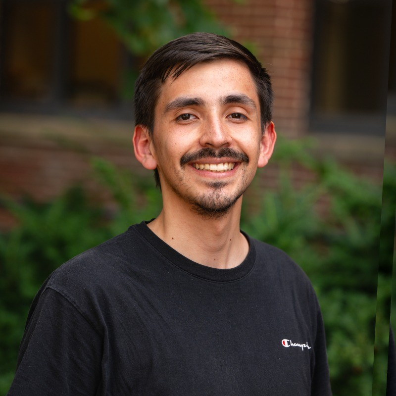

[Home](index.md) | [Bio](bio.md)

# Bio

I am a data scientist passionate about uncovering insights of the financial industry to contribute to the development of a sustainable and resilient financial system. 

I obtained my Master's degree in Data Science from the University of Michigan in 2025. Before my graduate degree, I studied Engineering at the Pontificia Universidad Catolica de Chile.

Would you like to talk something over? Discuss projects?

Let's connect!

[LinkedIn](https://www.linkedin.com/in/carlos-fc/)

E-mail: carlosfc(at)umich(dot)edu